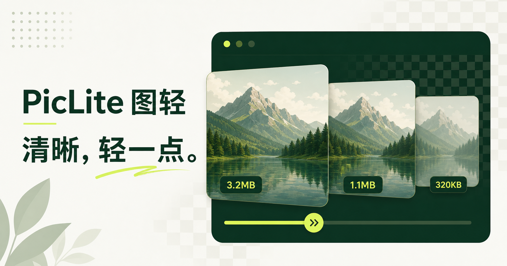

# PicLite

A local-first image optimiser for content creators and developers, available on Windows, macOS, Linux, and as a self-hosted web app.

[中文](README.md) · [Desktop downloads](https://github.com/amiaoapp/PicLite/releases) · [Web demo](https://piclite-image-optimiser.ritchiecessac4273.chatgpt.site) · [Issues](https://github.com/amiaoapp/PicLite/issues)



## Highlights

- Import, convert, optimise, and proportionally resize JPEG, PNG, WebP, and GIF files
- Automatically compare candidate formats and choose a smaller result with limited visual loss
- Before/after preview, actual output size, continuous quality and scale controls, and text watermarks
- Clipboard monitoring, global shortcuts, watched folders, and a local result library
- Clop-inspired floating results with copy, preview, undo, further downscaling, and format switching
- Configurable result limit, stacked/list layouts, and automatic dismissal
- Replace, rename beside the source, or export to a fixed folder with scheduled cleanup
- Upload to WebDAV, S3/R2, OSS, FTP, or SFTP image hosts
- Tauri 2 + Rust desktop apps; images stay on your device by default

## Download

Get the latest installers from [GitHub Releases](https://github.com/amiaoapp/PicLite/releases):

- Windows x64 / ARM64: `.exe` or `.msi`
- macOS Apple Silicon / Intel: `.dmg`
- Linux x64 / ARM64: `.AppImage` or `.deb`

The current macOS builds use ad-hoc signing. On first launch, macOS may require approval in System Settings → Privacy & Security.

## Web and Docker

```bash
docker run -d \
  --name piclite \
  -p 3000:3000 \
  --restart unless-stopped \
  ghcr.io/amiaoapp/piclite:latest
```

Open `http://SERVER_IP:3000`. Browser security restrictions mean that the web app cannot provide a system tray, global shortcuts, or persistent folder monitoring.

## Development

Requires Node.js 22.13+, stable Rust, and the Tauri 2 system dependencies for your target platform.

```bash
npm install
npm run dev
npm run desktop:dev
```

Test and build:

```bash
npm test
npm run desktop:build
```

## Privacy and licence

Optimisation runs locally in the browser or desktop app. Files leave your device only when you explicitly upload them to a storage provider you configured.

PicLite is licensed under [GPL-3.0-or-later](LICENSE). Its desktop automation workflow is inspired by and adapted from the GPL-licensed [FuzzyIdeas/Clop](https://github.com/FuzzyIdeas/Clop) project. PicLite does not use the Clop trademark. See [THIRD_PARTY_NOTICES.md](THIRD_PARTY_NOTICES.md).
