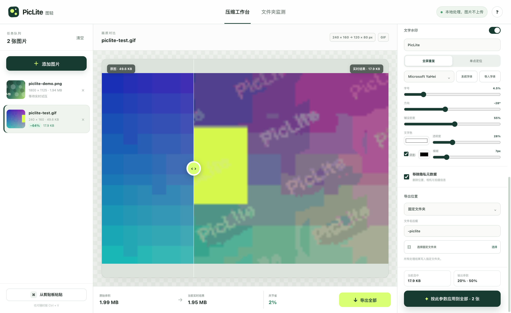
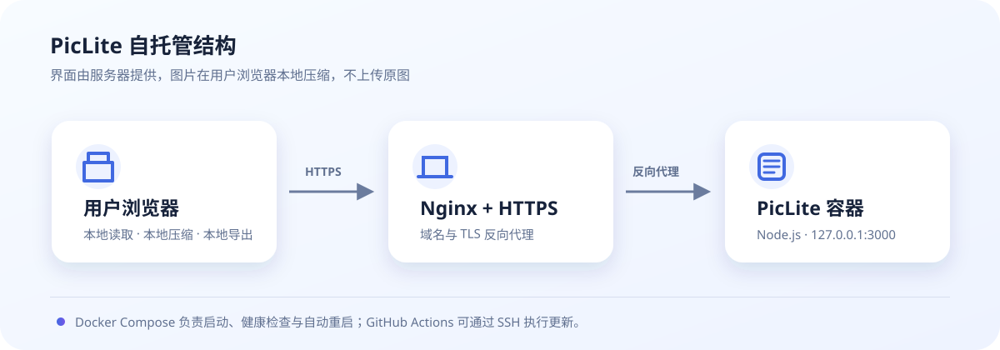

# PicLite 图轻


[](https://github.com/amiaoapp/PicLite/actions/workflows/release-desktop.yml)
[](https://github.com/amiaoapp/PicLite/releases)
[](https://nodejs.org/)
[](https://v2.tauri.app/)

PicLite 是一款本地优先、可自托管的图片与 GIF 压缩工作台，支持 Web、Windows、macOS 和 Linux。它可以在执行前实时预估输出体积，并用连续的画质和尺寸控制把文件压到你需要的大小。

[在线体验](https://piclite-image.zwistidjaa331.chatgpt.site) · [下载桌面版](https://github.com/amiaoapp/PicLite/releases) · [报告问题](https://github.com/amiaoapp/PicLite/issues)



## 功能

- 拖放、多文件选择和剪贴板粘贴导入
- JPG / PNG 无损元数据清理与编码优化
- JPG / PNG / WebP 格式转换，1–100% 连续画质调节
- 动态 GIF 逐帧压缩，保留动画并连续控制色板质量和尺寸
- 0.1–100% 等比例缩放、继续减半、最大宽高和禁止放大小图
- 每次滑动都从原图重新试压，在执行前显示真实输出体积、像素和前后画质对比
- 对比 / 原图 / 结果三种预览，可滚轮缩放、拖拽、适应窗口和 1:1 实际像素检查
- 智能防增大：缩放后若候选结果反而更大，自动降低编码质量；仍无法变小时保留原图
- 文字水印：本地字体、角度、字号、透明度、缩放、密度、全屏平铺、自由位置和阴影
- 下载、覆盖源文件、同文件夹重命名、固定文件夹四种导出模式
- 桌面端使用 Tauri 2 + Rust，原生处理文件选择、剪贴板、导出和文件夹监测
- 可读性优先的响应式桌面布局：窗口放大时面板和字号同步增长，Windows 125% / 150% 与 Retina 屏不再误判为紧凑模式
- 自动高 DPI 界面密度、完整浅色 / 深色 / 跟随系统主题，只有接近最小窗口时才主动收紧布局
- 仅在系统托盘 / macOS 菜单栏常驻：任务栏与 Dock 不显示图标，关闭或最小化主窗口后继续监测
- 可选开机自启动；登录系统后静默进入托盘，不主动弹出主窗口
- 可配置全局快捷键：显示主窗口、导入剪贴板图片、打开悬浮压缩坞
- 托盘唤起的置顶悬浮压缩坞：支持独立浅色 / 深色主题、窗口缩放和输出尺寸调节
- 自动恢复上次画质、缩放、水印、监测配置，并支持保存和删除自定义压缩预设
- 桌面专属应用设置：默认输出规则、固定目录、后缀、覆盖确认、托盘行为和关于页面
- Docker 自托管和 GitHub Actions 跨平台自动构建

图片处理在浏览器或桌面客户端本地完成，不会把原图上传到 PicLite 服务器。网页端受浏览器权限限制，持续文件夹监测只在桌面客户端提供。

## 下载桌面版

进入 [GitHub Releases](https://github.com/amiaoapp/PicLite/releases) 下载对应文件：

| 系统 | 架构 | 文件 |
| --- | --- | --- |
| Windows | x64 | NSIS 安装版 `.exe` 或 `.msi` |
| macOS | Apple Silicon（M1/M2/M3/M4…） | `arm64.dmg` |
| macOS | Intel | `x64.dmg` |
| Linux | x64 | `x86_64.AppImage` 或 `amd64.deb` |
| Linux | arm64 | `arm64.AppImage` 或 `arm64.deb` |

桌面版基于 Tauri，不再打包完整 Chromium；Windows 使用系统 WebView2，macOS 使用 WebKit，Linux 使用 WebKitGTK。本机实测 macOS `.app` 约 4.5 MB、DMG 约 2.1 MB，具体安装包大小会随平台格式变化。

当前 macOS 包使用 ad-hoc 签名，没有 Apple Developer ID 公证。首次打开时，如果系统提示无法验证开发者，请在“系统设置 → 隐私与安全性”中确认打开。正式公开分发建议配置 Apple Developer ID 签名与公证。

### 托盘与悬浮压缩坞

启动桌面版后，PicLite 只在 Windows 系统托盘、macOS 菜单栏或 Linux 状态区显示图标，不在 Windows 任务栏或 macOS Dock 保留图标。左键恢复主窗口，右键可以打开悬浮压缩坞、切换快速预设、主题与界面密度、启动或停止文件夹监测，以及完全退出应用。应用设置中还可以开启开机自启动并录制全局快捷键。

标准系统托盘 API 在 Windows、macOS 和 Linux 上没有统一的文件拖放事件，因此 PicLite 使用托盘菜单唤起一个无任务栏图标、始终置顶的“悬浮压缩坞”。把文件拖到压缩坞即可直接压缩；这比伪装成托盘拖放更可靠，也能显示逐张处理结果和继续压缩操作。悬浮压缩坞始终生成新文件，不会覆盖原图。

## 在服务器上部署

推荐使用 Ubuntu 22.04/24.04、Docker Compose、Nginx 和 HTTPS。服务器只负责提供页面；图片仍在访问者的浏览器中本地处理。



### 方式一：`docker run` 单命令部署

适合希望直接用 Docker 命令启动的服务器。仓库目前没有预构建的公共容器镜像，因此先从源码构建一次本地镜像：

```bash
git clone https://github.com/amiaoapp/PicLite.git /opt/piclite
cd /opt/piclite
docker build --pull -t piclite:local .
docker run -d \
  --name piclite \
  --restart unless-stopped \
  -p 127.0.0.1:3000:3000 \
  piclite:local
```

检查状态、健康检查和日志：

```bash
docker ps --filter name=piclite
docker inspect --format '{{.State.Health.Status}}' piclite
docker logs --tail=100 piclite
curl -I http://127.0.0.1:3000
```

更新代码并重建容器：

```bash
cd /opt/piclite
git pull --ff-only origin main
docker build --pull -t piclite:local .
docker rm -f piclite
docker run -d --name piclite --restart unless-stopped -p 127.0.0.1:3000:3000 piclite:local
```

停止、重新启动或彻底删除容器：

```bash
docker stop piclite
docker start piclite
docker rm -f piclite
```

端口只绑定在 `127.0.0.1`，请继续使用下文的 Nginx 和 HTTPS 配置对外提供服务。

### 方式二：Docker Compose（推荐长期维护）

#### 1. 准备服务器

先通过 SSH 登录服务器：

```bash
ssh 你的用户名@服务器IP
```

安装 Git 和 Nginx：

```bash
sudo apt update
sudo apt install -y git nginx
```

按照 [Docker 官方 Ubuntu 安装教程](https://docs.docker.com/engine/install/ubuntu/) 安装 Docker Engine，并按照 [Compose 插件教程](https://docs.docker.com/compose/install/linux/) 安装 `docker compose`。安装后检查：

```bash
docker --version
docker compose version
```

如果当前用户没有 Docker 权限，可先用 `sudo docker ...`，或按 Docker 官方文档把用户加入 `docker` 用户组后重新登录。

#### 2. 下载 PicLite

```bash
sudo mkdir -p /opt/piclite
sudo chown "$USER":"$USER" /opt/piclite
git clone https://github.com/amiaoapp/PicLite.git /opt/piclite
cd /opt/piclite
```

#### 3. 构建并启动

```bash
docker compose up -d --build
docker compose ps
```

`docker-compose.yml` 默认只把服务开放到服务器本机的 `127.0.0.1:3000`，避免绕过 Nginx 直接暴露应用。先在服务器内检查：

```bash
curl -I http://127.0.0.1:3000
docker compose logs --tail=100 piclite
```

如果状态是 `200`，说明 PicLite 已正常运行。

#### 4. 绑定域名

先在域名服务商处添加一条 `A` 记录，指向服务器公网 IP。然后复制仓库内的 Nginx 模板：

```bash
cd /opt/piclite
sed 's/piclite.example.com/piclite.你的域名.com/g' deploy/nginx/piclite.conf \
  | sudo tee /etc/nginx/sites-available/piclite >/dev/null
sudo ln -s /etc/nginx/sites-available/piclite /etc/nginx/sites-enabled/piclite
sudo nginx -t
sudo systemctl reload nginx
```

把命令中的 `piclite.你的域名.com` 换成真实域名。如果 `/etc/nginx/sites-enabled/piclite` 已存在，不需要重复创建软链接。

#### 5. 开启 HTTPS

```bash
sudo apt install -y certbot python3-certbot-nginx
sudo certbot --nginx -d piclite.你的域名.com
```

完成后访问 `https://piclite.你的域名.com`。剪贴板、字体和文件夹写入等浏览器能力通常要求 HTTPS 或 localhost，因此正式部署应开启 HTTPS。

#### 6. 更新版本

以后发布新代码，只需在服务器运行：

```bash
cd /opt/piclite
git pull --ff-only origin main
docker compose up -d --build --remove-orphans
docker image prune -f
```

查看日志与停止服务：

```bash
docker compose logs -f piclite
docker compose down
```

PicLite 不保存用户图片，也没有数据库或持久化目录，因此无需备份图片数据；只需备份你修改过的 Nginx、域名和部署配置。

### 方式三：Node.js + systemd

不使用 Docker 时，在服务器安装 Node.js 24（最低 22.13），然后执行：

```bash
sudo mkdir -p /opt/piclite
sudo chown "$USER":"$USER" /opt/piclite
git clone https://github.com/amiaoapp/PicLite.git /opt/piclite
cd /opt/piclite
npm ci
npm run build
node dist/standalone/server.js
```

生产环境可使用仓库附带的 systemd 服务。确认 `/usr/bin/node` 是正确的 Node.js 路径后运行：

```bash
sudo useradd --system --home /opt/piclite --shell /usr/sbin/nologin piclite || true
sudo chown -R piclite:piclite /opt/piclite
sudo cp /opt/piclite/deploy/systemd/piclite.service /etc/systemd/system/piclite.service
sudo systemctl daemon-reload
sudo systemctl enable --now piclite
sudo systemctl status piclite
```

Nginx 和 HTTPS 配置与 Docker 方式相同。

### 用 GitHub Actions 一键更新服务器（可选）

仓库内的 `Deploy web app to server` 工作流可通过 SSH 执行 `git pull` 和 `docker compose up`。在 GitHub 仓库进入 `Settings → Secrets and variables → Actions`，添加：

| Secret | 内容 |
| --- | --- |
| `SERVER_HOST` | 服务器 IP 或域名 |
| `SERVER_USER` | SSH 用户名 |
| `SERVER_PATH` | 项目目录，例如 `/opt/piclite` |
| `SERVER_SSH_KEY` | GitHub Actions 使用的 SSH 私钥全文 |
| `SERVER_KNOWN_HOSTS` | 服务器的 SSH host key |

`SERVER_KNOWN_HOSTS` 可在可信网络中用下面的命令生成，并核对服务器指纹后再保存：

```bash
ssh-keyscan -H 你的服务器IP
```

设置完成后打开仓库的 `Actions → Deploy web app to server → Run workflow`。工作流默认不会在每次提交时自动部署，避免误操作；需要时手动点击即可。

## 本地运行网页端

需要 Node.js 24（最低 22.13）：

```bash
git clone https://github.com/amiaoapp/PicLite.git
cd PicLite
npm install
npm run dev
```

打开 `http://localhost:3000`。

## 本地运行桌面端

先安装 [Tauri 2 系统依赖](https://v2.tauri.app/start/prerequisites/) 和 Rust。Windows 需要 Microsoft C++ Build Tools 与 WebView2，Linux 需要 WebKitGTK；macOS 需要 Xcode Command Line Tools。然后执行：

```bash
npm ci
npm run desktop:dev
```

Tauri 会自动启动专用 Vite 渲染器和 Rust 后端。正式安装包内置界面，可以离线启动；不需要另开网页开发服务。

## 构建 Windows、macOS 和 Linux

先安装依赖：

```bash
npm ci
```

然后在对应系统运行：

```bash
# Windows：NSIS 安装版 + MSI
npm run desktop:build:win

# macOS：指定架构，输出 DMG
npm run desktop:build:mac:arm64
npm run desktop:build:mac:x64

# Linux：指定架构
npm run desktop:build:linux:arm64
npm run desktop:build:linux:x64
```

当前系统默认架构也可以直接运行 `npm run desktop:build`。产物位于 `src-tauri/target/<target>/release/bundle/`。桌面应用应在目标操作系统构建；仓库的 GitHub Actions 使用 Windows、macOS 和 Linux 原生 runner。

### 自动生成 GitHub Release

推送版本标签后，GitHub Actions 会构建五组桌面产物，并自动创建 Release：

```bash
git tag v0.6.3
git push origin v0.6.3
```

只想测试构建、不发布版本时，在 GitHub 的 `Actions → Build desktop apps → Run workflow` 手动运行。手动运行的文件会保存在该次工作流的 Artifacts 中。

## 压缩策略

- **无损优先**：优先清理可安全移除的元数据，并在没有视觉变换时只接受更小的结果；否则保留原文件。
- **智能平衡**：适合日常照片和网页素材，兼顾清晰度与体积。
- **更小体积**：降低质量或使用 PNG 调色板，适合缩略图和加载性能敏感场景。
- **连续试压**：画质最低 1%，尺寸最低 0.1%（最终不少于 1 × 1 像素）。每次都从原始文件重新编码，避免重复压缩造成累积损伤。
- **PNG 画质**：通过颜色量化让画质滑块真实影响 PNG 体积，并保留透明通道。
- **GIF 画质**：手动工作台逐帧重新生成 2–256 色色板；Rust 自动监测也会保留动画、调整尺寸并量化颜色。
- **尺寸与体积保护**：通常只改变像素尺寸；若重新编码后的文件反而超过原图，默认会逐步寻找更小且尽量清晰的编码，最后仍无法变小时保留原文件。实时结果会明确显示是否触发自动质量调整。
- **预览清晰度**：对比模式为了对齐会把结果显示为相同视觉尺寸；切换“结果”并点击 1:1，可按真实像素检查缩小图。

## 导出说明

- **浏览器下载**：兼容性最好，不需要文件夹权限。
- **覆盖源文件**：需要从“添加图片”按钮导入并授权写入；为避免扩展名与内容不一致，只允许保持原格式。
- **原文件夹重命名**：桌面端自动定位每张源图的文件夹；网页端需要手动授权目标文件夹。
- **固定文件夹**：选择一次输出目录后，批量结果统一写入，并使用可编辑的文件名后缀。

自动监测默认把结果写入来源文件夹下的 `PicLite/`，使用 `-piclite` 后缀，不覆盖源文件。

## 项目结构

```text
app/                         Web 界面与本地实时压缩逻辑
desktop/                     Tauri 专用渲染入口与类型安全桥接
src-tauri/                   Rust 后端、文件夹监听、系统集成与打包配置
deploy/nginx/                Nginx 反向代理模板
deploy/systemd/              Node.js systemd 服务模板
.github/workflows/           跨平台构建、Release、服务器部署
Dockerfile                   Web 多阶段生产镜像
docker-compose.yml           自托管启动与健康检查
```

## 隐私说明

Web 版通过浏览器的 Canvas、WebCodecs 和文件系统能力本地处理图片；服务器只提供静态资源和应用代码。桌面版通过系统 WebView 与 Rust 后端在设备本地处理，不内置图片上传接口。
